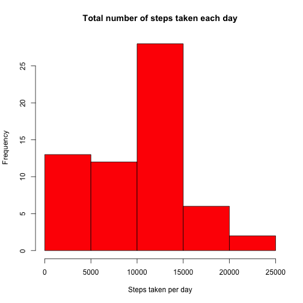
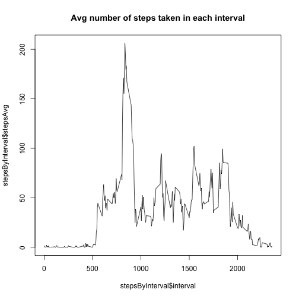

This document will answer questions posed by the Reproducible Research teaching department. It will include questions, ways we got to answers and R code that helped answer these questions.

## Loading and preprocessing the data
The data with Activity Monitor data is in the same folder as this markdown document.
Since the data is in the .zip format, we'll have to unzip it first and then read into a data frame.


```r
## Unzip the file
unzip("activity.zip")

## Read the data form the file into a dataframe
activityData <- read.csv("activity.csv")
```

## What is mean total number of steps taken per day?
To answer this question, we will first use the dpply function to get the total number of steps per date:


```r
library(plyr)
## Calculate the the total number of steps taken per day
stepsByDate <- ddply(activityData, .(date), summarize, 
                     stepsTotal=sum(steps, na.rm=TRUE))
print(stepsByDate)
```

```
##          date stepsTotal
## 1  2012-10-01          0
## 2  2012-10-02        126
## 3  2012-10-03      11352
## 4  2012-10-04      12116
## 5  2012-10-05      13294
## 6  2012-10-06      15420
## 7  2012-10-07      11015
## 8  2012-10-08          0
## 9  2012-10-09      12811
## 10 2012-10-10       9900
## 11 2012-10-11      10304
## 12 2012-10-12      17382
## 13 2012-10-13      12426
## 14 2012-10-14      15098
## 15 2012-10-15      10139
## 16 2012-10-16      15084
## 17 2012-10-17      13452
## 18 2012-10-18      10056
## 19 2012-10-19      11829
## 20 2012-10-20      10395
## 21 2012-10-21       8821
## 22 2012-10-22      13460
## 23 2012-10-23       8918
## 24 2012-10-24       8355
## 25 2012-10-25       2492
## 26 2012-10-26       6778
## 27 2012-10-27      10119
## 28 2012-10-28      11458
## 29 2012-10-29       5018
## 30 2012-10-30       9819
## 31 2012-10-31      15414
## 32 2012-11-01          0
## 33 2012-11-02      10600
## 34 2012-11-03      10571
## 35 2012-11-04          0
## 36 2012-11-05      10439
## 37 2012-11-06       8334
## 38 2012-11-07      12883
## 39 2012-11-08       3219
## 40 2012-11-09          0
## 41 2012-11-10          0
## 42 2012-11-11      12608
## 43 2012-11-12      10765
## 44 2012-11-13       7336
## 45 2012-11-14          0
## 46 2012-11-15         41
## 47 2012-11-16       5441
## 48 2012-11-17      14339
## 49 2012-11-18      15110
## 50 2012-11-19       8841
## 51 2012-11-20       4472
## 52 2012-11-21      12787
## 53 2012-11-22      20427
## 54 2012-11-23      21194
## 55 2012-11-24      14478
## 56 2012-11-25      11834
## 57 2012-11-26      11162
## 58 2012-11-27      13646
## 59 2012-11-28      10183
## 60 2012-11-29       7047
## 61 2012-11-30          0
```
The histogram of the total number of steps taken each day (ignoring the missing values):

```r
## Histogram of the total number of steps
hist(as.numeric(stepsByDate$steps), xlab="Steps taken per day",main="Total number of steps taken each day", col="red")
```

 

#### Mean and median total number of steps taken per day


```r
## Mean and median
pMean <- mean(stepsByDate$stepsTotal, na.rm=TRUE)
pMedian <- median(stepsByDate$stepsTotal, na.rm=TRUE)
```

*Mean of the total number of steps taken per day = 9354.2295082*  
*Median of the total number of steps taken per day = 10395*  

## What is the average daily activity pattern?
Time series plot of the 5-minute interval and the average number of steps taken, averaged across all days:

```r
## Average number of steps by 5-minute interval
stepsByInterval <- ddply(activityData, .(interval), summarize, stepsAvg=mean(steps, na.rm=TRUE))

## Plot describing average number of steps (over all dates) for each 5-minute time interval
plot(stepsByInterval$interval,stepsByInterval$stepsAvg, type="l", main="Avg number of steps taken (averaged across all days) within each 5-minute interval")
```

 


```r
## Finding the interval with maximum average number of steps across all days
maxInterval <- stepsByInterval[stepsByInterval$stepsAvg == max(stepsByInterval$stepsAvg),]$interval
```
*On average across all the days in the dataset, 5-minute interval number 835 contains the maximum number of steps*

## Imputing missing values

```r
## Number of missing values in the activity data set
stepsNA <- sum(is.na(activityData$steps))
```
*The total number of rows where steps field is NA is 2304*

We will create a new dataset that is equal to the original dataset but with the missing data filled in.
We will use the mean for that 5-minute interval.
We will name the new data frame. filledActivityData

```r
## Creating a new data set where NA values for "steps" fields are replaced with ## the average value of steps in that given data interval
filledActivityData <- activityData
filledActivityData$filledSteps <- ifelse(is.na(filledActivityData$steps),stepsByInterval$stepsAvg[stepsByInterval$interval %in% filledActivityData$interval],filledActivityData$steps)
## Drop the old column steps
filledActivityData$steps <- NULL
names(filledActivityData) = c("date", "interval","steps")
```

Histogram of the total number of steps taken each day  - for the newly created data set where NA steps were filled with values:


```r
## In order to draw this histogram, we first need to calculate the the total number of steps taken per day in FILLED activityData
stepsByDateFilled <- ddply(filledActivityData, .(date), summarize, 
                     stepsTotal=sum(steps, na.rm=TRUE))

## Histogram of the total number of steps in FILLED activityData
hist(as.numeric(stepsByDateFilled$steps), xlab="Steps taken per day",main="Total number of steps taken each day - NAs replaced", col="red")
```

 

#### Mean and median total number of steps taken per day in the data set where NA  were replaced with non-NA values


```r
## Mean and median in FILLED activityData
filledMean <- mean(stepsByDateFilled$stepsTotal, na.rm=TRUE)
filledMedian <- median(stepsByDateFilled$stepsTotal, na.rm=TRUE)
```

*Mean of the total number of steps taken per day in the data set where NA  were replaced with non-NA values  = 1.0766189 &times; 10<sup>4</sup>*
*Median of the total number of steps taken per day in the data set where NA  were replaced with non-NA values = 1.0766189 &times; 10<sup>4</sup>* 

As we can see, these values are different from the initial data set. 
Do these values differ from the estimates from the first part of the assignment? What is the impact of imputing missing data on the estimates of the total daily number of steps?

## Are there differences in activity patterns between weekdays and weekends?

We will create a new factor variable in the dataset with two levels -- "weekday" and "weekend" indicating whether a given date is a weekday or weekend day.


```r
## Adding weekday
filledActivityData$day <- weekdays(as.POSIXct(filledActivityData$date))
filledActivityData$weekday <- ifelse(filledActivityData$day %in% c("Saturday", "Sunday"), "weekend","weekday")
filledActivityData$weekday <- as.factor(filledActivityData$weekday)

## I will delete the day column - it was there just to help with creation of the ## "weekday" column
filledActivityData$day <- NULL
```

We will make a panel plot containing a time series plot of the 5-minute interval (x-axis) and the average number of steps taken, averaged across all weekday days or weekend days (y-axis). 

In order to do that we'll have to create a data set first that will calculate average number of steps per interval across all days thatare weekend or weekday


```r
## What is the average daily activity pattern when NA activityData is FILLED?
## Average number of steps by 5-minute interval
stepsByIntervalFilled <- ddply(filledActivityData, .(weekday,interval), summarize, stepsAvg=mean(steps, na.rm=TRUE))

## Plot describing average number of steps (over all dates) for each 5-minute ## time interval
library(ggplot2)
p <- ggplot(stepsByIntervalFilled, aes(x=interval, y=stepsAvg)) + geom_line()
p+facet_grid(weekday~.)
```

 
